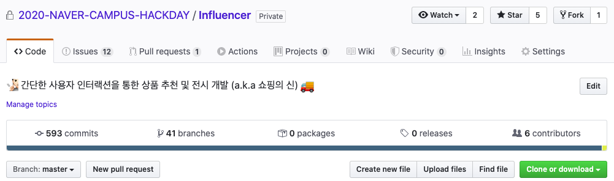
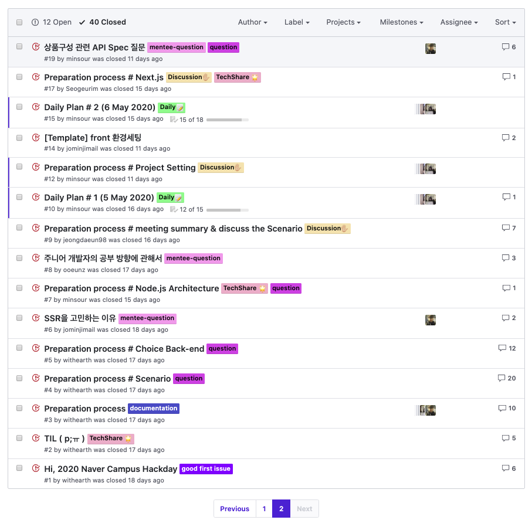
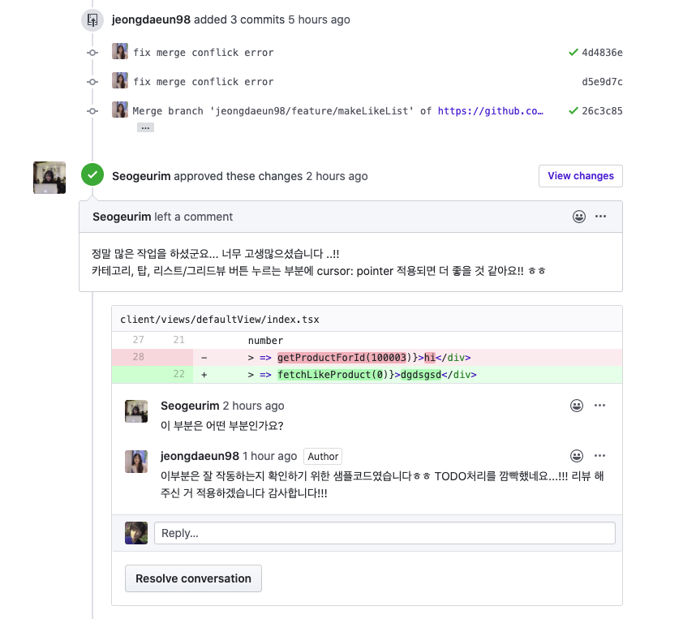
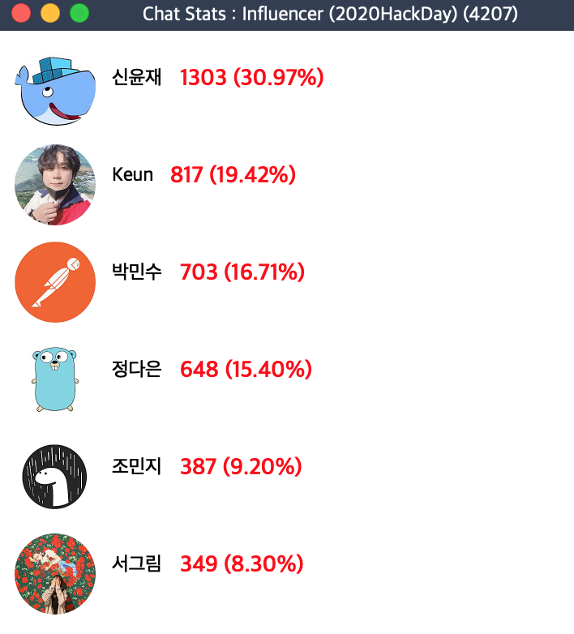
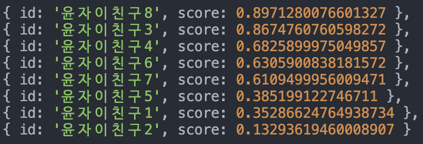

# INFLUENCER


[](https://github.com/dwyl/esta/issues)
[](https://github.com/microsoft/TypeScript) 

<div align="center" style="display:flex;">
	
</div>

<div align="center">
<br>
간단한 사용자 인터랙션을 통한 상품 추천 및 전시 개발 (a.k.a 쇼핑의 신)

</div>

\
[]()

---
\
\
[]()
## 🔖우리 조는 3주동안...

#### 500여개의 **commit**과 40여개의 **branch** 50여개의 **issue** 가 있었어요!

<div align="center" style="display:flex;">
	
</div>


\
[]()

| ISSUE | Code Review| Line |
|-------|------------|------|
| |  |  |
| issue를 이용한 논의 내용정리 및 시나리오 설정 | 2명 이상의 code review와 approve를 통한 merge 과정 | Line 메신저를 통해 지속적인 마이크로 인터렉션 |


\
[]()
## 📋 Flow chart
1. 유저가 선호하는 인터렉션 & 찜 추가 & 클릭로그를 수집
2. 데이터에 맞게 선호하는 상품에 대한 가중치 점수를 부여
3. 취향이 비슷한 유저를 검색 후 맞춤형 상품 추천 (collaborative filtering algorithm)
<div align="center" style="display:flex;">
	
</div>


\
[]()
## 🛠 Using Technology
* [Typescript](https://www.typescriptlang.org/)
* [React.js](https://ko.reactjs.org/)
* [Express](https://expressjs.com/ko/)
* [MongoDB](https://www.mongodb.com/)
* [Docker](https://www.docker.com/)
* [Swagger](https://swagger.io/)

---
\
\
[]()
## 💻 팀원
| **멘토** | **멘티** |
|----------|-----|
| 👨‍💻[배근배](https://github.com/withearth)| 👩‍💻[서그림](https://github.com/Seogeurim) |
||👩‍💻[정다은](https://github.com/jeongdaeun98)|
||👩‍💻[조민지](https://github.com/jominjimail) |
||👨‍💻[신윤재](https://github.com/ooeunz)|
||👨‍💻[서민수](https://github.com/minsour)|


\
\
[]()
## ⚙️ Dependencies
### Front-end
```json
"dependencies": {
		"@egjs/react-infinitegrid": "3.0.4",
		"@material-ui/core": "^4.9.13",
		"@types/react-redux": "^7.1.8",
		"axios": "^0.19.2",
		"clsx": "^1.1.0",
		"dotenv": "^8.2.0",
		"immer": "^6.0.5",
		"lodash": "^4.17.15",
		"next": "^9.3.6",
		"next-redux-wrapper": "^6.0.0",
		"node-fetch": "^2.6.0",
		"react": "^16.13.1",
		"react-dom": "^16.13.1",
		"react-gesture-responder": "^2.1.0",
		"react-grid-dnd": "^2.1.2",
		"react-hammerjs": "^1.0.1",
		"react-redux": "^7.2.0",
		"redux": "^4.0.5",
		"redux-devtools-extension": "^2.13.8",
		"redux-saga": "^1.1.3",
		"styled-components": "^5.1.0",
		"typesafe-actions": "^5.1.0",
		"webpack": "^4.43.0"
	},
	"devDependencies": {
		"@types/dotenv": "^8.2.0",
		"@types/jest": "^24.0.0",
		"@types/material-ui": "^0.21.7",
		"@types/next": "^9.0.0",
		"@types/node": "^13.13.5",
		"@types/react": "^16.9.34",
		"@types/react-dom": "^16.9.0",
		"@types/styled-components": "^5.1.0",
		"@typescript-eslint/eslint-plugin": "^2.24.0",
		"@typescript-eslint/parser": "^2.31.0",
		"eslint": "^6.8.0",
		"eslint-config-airbnb-typescript": "^7.2.1",
		"eslint-plugin-import": "^2.20.2",
		"eslint-plugin-jsx-a11y": "^6.2.3",
		"eslint-plugin-react": "^7.19.0",
		"eslint-plugin-react-hooks": "^2.5.0",
		"typescript": "^3.8.3"
```

\
[]()
### Back-end
```json
"dependencies": {
    "celebrate": "12.1.1",
    "content-based-recommender": "^1.4.0",
    "cors": "^2.8.5",
    "dotenv": "^8.2.0",
    "express": "^4.17.1",
    "mongoose": "5.9.13",
    "nodemon": "^2.0.3",
    "pm2": "^4.4.0",
    "swagger-ui-express": "4.1.4",
    "typedi": "^0.8.0",
    "winston": "3.2.1"
  },
  "devDependencies": {
    "@types/chai": "4.2.11",
    "@types/cors": "2.8.6",
    "@types/express": "4.17.6",
    "@types/mocha": "7.0.2",
    "@types/mongoose": "5.7.16",
    "@types/node": "13.13.5",
    "@types/sinon": "9.0.0",
    "@types/supertest": "2.0.9",
    "@types/swagger-ui-express": "4.1.2",
    "@types/winston": "2.4.4",
    "chai": "4.2.0",
    "mocha": "7.1.2",
    "sinon": "9.0.2",
    "supertest": "4.0.2",
    "ts-node": "8.10.1",
    "typescript": "3.8.3"
  }
```